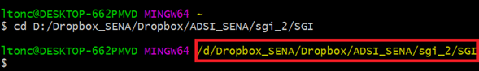

<!-- @format -->

# Comandos de GIT Básicos

## Entendiendo cómo funciona GIT

GIT es el SCV (sistema de control de versiones) de código abierto más utilizado que te permite rastrear los cambios realizados en los archivos. Las empresas y los programadores suelen utilizar el GIT para colaborar en el desarrollo de software y aplicaciones.

Un proyecto GIT consta de tres secciones principales: **el directorio de trabajo** , **el área de preparación** y **el directorio git** .

El directorio de trabajo es donde se agregan, borran y editan los archivos. Luego, los cambios son preparados (indexados) en el área de preparación. Después de que confirmes tus cambios, la instantánea de los cambios se guardará en el directorio git.

### Cómo instalar GIT en Windows

En Windows, sólo tienes que descargar el instalador y ejecutarlo. Sigue estos sencillos pasos para hacerlo:

1. [Descarga](https://git-scm.com/downloads) el instalador de GIT para Windows.
2. Una vez que hayas descargado el instalador, haz doble clic sobre el ejecutable para que comience el proceso de instalación y sigue las instrucciones que te aparecerán en pantalla. Al igual que cualquier otro programa, tendrás que dar **“Next”** (siguiente) en varias ocasiones hasta que aparezca la opción **“Finish”** (terminar) para completar la instalación.

   > Git para Windows proporciona una emulación de BASH que se usa para ejecutar Git desde la línea de comandos.

3. Ahora tienes que abrir **Git Bash** y escribir los siguientes comandos en la terminal:

   ```
   git --version
   ```

   **Verificamos que git se instaló correctamente**, nos debería salir la versión que tenemos instalada de **git** en nuestro ordenador.

4. Configuración de git:

   ```
   git config --global user.name "Tu nombre"
   git config --global user.email tuemail@email.com
   ```

   Ya con esto tenemos configurado git.

5. Configuración del edictor de texto, para casos practicos se configurar [VS Code](https://code.visualstudio.com/download); usted puede configurar el editor de texto de su preferencia.

   ```
   git config --global core.editor "code --wait"
   Nota: La opción --wait es para que la terminal se quede esperando hasta que cerremos el editor de texto. Para ver el archivo de configuración global debemos escribir el siguiente comando: git config --global -e
   ```

   ### Empezando a trabajar con GIT

   1. Abre **Git Bash,** ubícate en el directorio raíz de tu proyecto; Para el ejemplo yo ubicaré este directorio **“D:\Dropbox_SENA\Dropbox\ADSI_SENA\sgi_2\SGI”** tu debes ubicar el de tu proyecto.
   2. A continuación, escribe el comando: `cd` seguido del directorio del proyecto.
      `cd D:/Dropbox_SENA/Dropbox/ADSI_SENA/sgi_2/SGI`
      
   3. Crea el archivo **README.md** con el comando `echo >> README.md`

      **NOTA:** _El **README** es el archivo en el cual hacemos la descripción del proyecto, ya sea open source o privados es importante tener un buen README. Este archivo se escribe con formato [markdown](https://docs.github.com/es/get-started/writing-on-github/getting-started-with-writing-and-formatting-on-github/basic-writing-and-formatting-syntax).
      **[Markdown](https://docs.github.com/es/get-started/writing-on-github/getting-started-with-writing-and-formatting-on-github/basic-writing-and-formatting-syntax)**, es un formato de escritura que permite la generación de contenido fácil y rápido, permite generar una salida (por lo general) en formato HTML sin necesidad de aprender a profundidad HTML. Es ampliamente utilizado por su facilidad de generar texto enriquecido._

   4. Escribe el comando `git init` para inicializar el repositorio local.
   5. Por defecto al inicializar el repositorio local se crea una rama llamada **master** esta rama debemos renombrarla a **main** y para hacer esto escribimos el comando `git branch -M main`
   6. Ya inicializado el repositorio local con el comando `git status` vemos los archivos que se van a agregar al repositorio local.
   7. Con el comando `git add .` agregamos esos archivo al área de preparación **(Staged)**.
   8. Con `git commit -m "first commit"` creamos nuestro primer `commit` y pasamos los archivos del área de preparación **(Staged)** al repositorio local.

      **NOTA:** `-m ""` S*e utiliza para dejar un comentario en el `commit` dentro de las collas se escribe el comentario, este comentario es informativo e indica si se agregó, modifico o elimino algo en el proyecto.*

   9. Muy bien en este punto ya tenemos nuestro proyecto en un repositorio local, ahora lo que nos falta es subirlo a un repositorio remoto en [GitHub](https://github.com/). Para esto debe estar previamente registrado y haber creado un creado un [nuevo repositorio](https://docs.github.com/es/get-started/quickstart/create-a-repo).
   10. Para subir el repositorio local a [GitHub](https://github.com/) escribimos el comando `git remote add origin` segido de la URL del repositorio remoto.

       - `git remote add origin https://github.com/tu_usuario_de_github/nombre_del_repositorio.git`

   11. Por último con `git push -u origin main` Enviamos al repositorio remoto todos los archivos agregados en el repositorio local.
